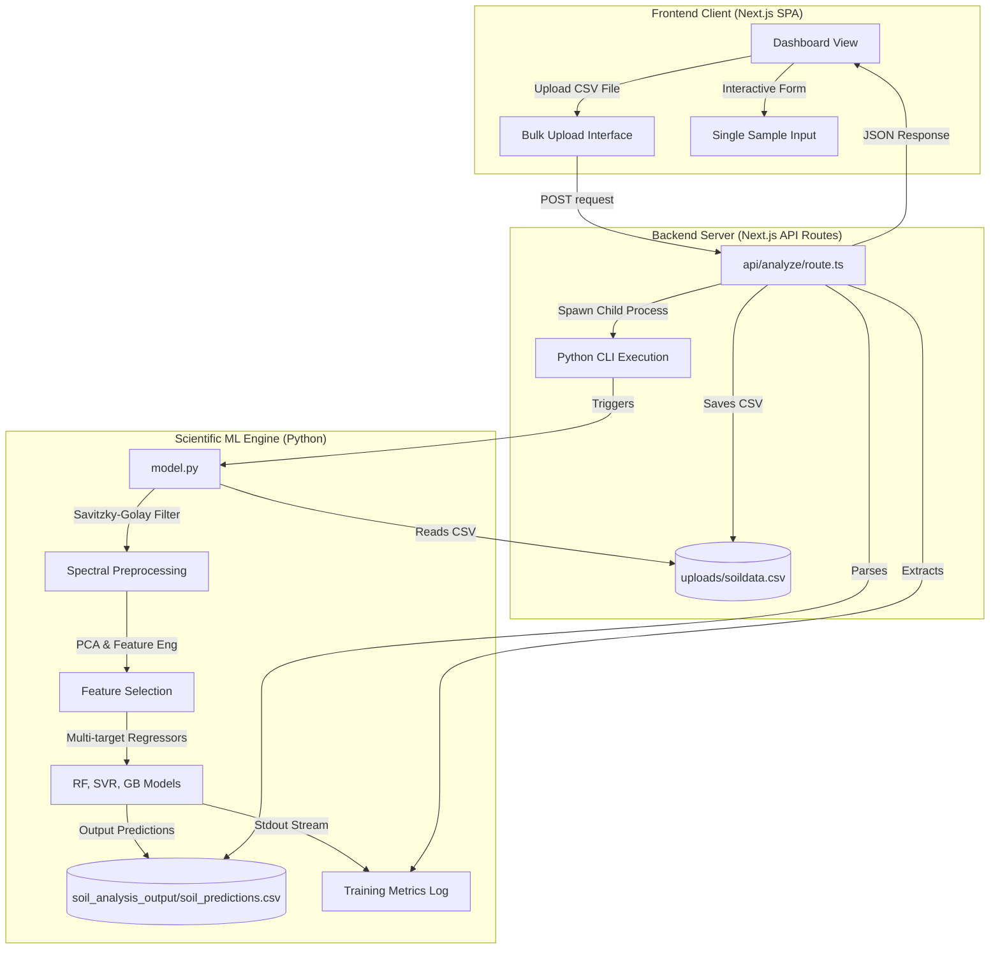

# 🌱 AI-Powered Soil Health Checker (Soil Health AI)

[](https://nextjs.org/)
[](https://react.dev/)
[](https://www.typescriptlang.org/)
[](https://tailwindcss.com/)
[](https://www.python.org/)
[](https://scikit-learn.org/)
[](https://pandas.pydata.org/)
[](https://numpy.org/)

An industry-grade, full-stack predictive agricultural intelligence platform. This solution empowers small and marginal farmers to assess soil quality instantly. By combining a modern web frontend with a high-performance Python Machine Learning engine, it processes soil sensor readings and near-infrared spectroscopy (NIRS) spectral data to deliver precise crop, fertilizer, and irrigation recommendations.

---

## 🗺️ System Architecture

The application implements a polyglot architectural pattern connecting a high-speed React server ecosystem with a specialized scientific Python environment.



---

## ⚡ Core Features

*   **Dual Mode Analytics**:
    *   **Bulk Upload**: Upload large-scale spectrometer and sensor CSV files to analyze multiple farm plots simultaneously.
    *   **Single-Sample Wizard**: Input 18 specific spectral wavelengths (410nm to 940nm) to get real-time soil health assessment.
*   **Machine Learning Multi-Regressor**: Automatically trains and evaluates **Random Forest**, **Gradient Boosting**, and **Support Vector Regression (SVR)** to predict pH, moisture, electrical conductivity (EC), and NPK levels.
*   **Aesthetic UI Dashboards**: Fully responsive interface featuring interactive charts (comparing samples across moisture stages), animated gauges, and clean, theme-aware layouts.
*   **Intelligent Agricultural Advisory**: Generates personalized action items for irrigation, pH correction (liming/sulfur treatment), and customized NPK fertilizer ratios.
*   **Hybrid Server Architecture**: Next.js route handlers orchestrate background Python executions, parsing results and stdout stream logs in real-time.

---

## 🧪 Machine Learning Pipeline

The ML module (`model.py`) performs scientific analysis of Near-Infrared Spectroscopy (NIRS) and soil physical chemistry data:

1.  **Imputation & Cleaning**: Resolves null entries and zero-values in active sensor inputs using a `KNNImputer` ($k=3$).
2.  **Spectral Preprocessing**: Smooths the 18 wavelengths (410nm - 940nm) using a **Savitzky-Golay filter** (`window_length=11`, `polyorder=2`) to remove high-frequency signal noise.
3.  **Spectral Index Calculation**: Computes the Normalized Difference Index (NDI) and Simple Ratio (SIR):
    $$\text{NDI} = \frac{R_{860} - R_{645}}{R_{860} + R_{645}}$$
    $$\text{SIR} = \frac{R_{730}}{R_{680}}$$
4.  **Dimensionality Reduction**: Employs **Principal Component Analysis (PCA)** on spectral features to capture $>95\%$ variance in the top 5 components, preventing collinearity.
5.  **Feature Selection**: Selects features via Random Forest variable importance metrics, optimizing computation speed.
6.  **Optimized Regression & Hyperparameter Tuning**: Trains Random Forest, SVR, and Gradient Boosting Regressors using a **5-Fold Cross-Validation** strategy.

---

## 📁 Repository Structure

```text
├── app/
│   ├── api/
│   │   └── analyze/
│   │       └── route.ts         # Handles file saving, spawns Python process, parses output
│   ├── globals.css              # Custom Tailwind configuration
│   ├── layout.tsx               # Primary application layout & providers
│   └── page.tsx                 # Main dashboard layout, tabs, & presentation
├── components/
│   ├── ui/                      # Reusable UI components (buttons, tabs, cards, charts)
│   ├── model-metrics.tsx        # Displays ML accuracy (R2, RMSE, MSE)
│   ├── soil-charts.tsx          # Soil parameter distribution visualization
│   ├── soil-health-gauge.tsx    # Evaluates overall health (0-100)
│   ├── soil-recommendations.tsx # Generates dynamic fertilizing & agricultural action plans
│   ├── soil-sample-table.tsx    # Interactive table view for tabular predictions
│   └── spectral-data-form.tsx   # Manual 18-wavelength entry form
├── hooks/
│   └── use-toast.ts             # User notification system
├── lib/
│   ├── soil-analysis.ts         # Service utilities & mock data fallback layer
│   └── utils.ts                 # Class merger tailwind-merge helper
├── public/                      # Static assets & placeholder vectors
├── model.py                     # Scientific data pipeline & Machine Learning core
├── package.json                 # Node.js configurations & dependencies
├── tailwind.config.ts           # CSS styling rules
└── tsconfig.json                # TypeScript settings
```

---

## ⚙️ Installation & Setup

### 1. Prerequisites
Ensure you have the following installed on your machine:
*   [Node.js](https://nodejs.org/) (v18.x or v20.x recommended)
*   [Python 3.9+](https://www.python.org/downloads/)
*   `pnpm` or `npm` package manager

### 2. Python Dependencies Installation
Install the scientific stack required for training the ML pipeline:
```bash
pip install pandas numpy scikit-learn scipy matplotlib seaborn shap
```

### 3. Node.js Frontend Setup
To prevent dependency conflicts between React versions and helper libraries, execute the following commands in the project root:
```bash
# Clean up older packages
npm uninstall date-fns react react-dom react-day-picker

# Install clean React 18 & compatible components
npm install react@18 react-dom@18 date-fns@2.29.3 react-day-picker@8.10.1

# Install project dependencies
npm install
```

### 4. Running the Development Server
Launch the local development environment:
```bash
npm run dev
```
Open [http://localhost:3000](http://localhost:3000) in your browser to view the application.

---

## 📊 Expected CSV File Schema

To run bulk analysis successfully, your CSV file should contain spectrometer readings and physical properties in the following format:

| Records (or Soil_ID) | Moist | EC (u/10 gram) | Ph | Nitro (mg/10 g) | Posh Nitro (mg/10 g) | Pota Nitro (mg/10 g) | 410 | 435 | ... | 940 |
| :--- | :--- | :--- | :--- | :--- | :--- | :--- | :--- | :--- | :--- | :--- |
| Sample_1_0ml | 14.5 | 820 | 6.2 | 18.2 | 12.1 | 24.5 | 0.22 | 0.25 | ... | 0.78 |
| Sample_2_25ml | 36.1 | 790 | 6.8 | 19.5 | 13.0 | 25.1 | 0.21 | 0.24 | ... | 0.76 |
| Sample_3_50ml | 54.8 | 840 | 6.5 | 17.9 | 11.8 | 23.9 | 0.23 | 0.26 | ... | 0.81 |

*Note: The system automatically parses the suffix `_0ml`, `_25ml`, or `_50ml` in the ID to filter samples by moisture level.*

---

## 🛡️ API Endpoints

### Run Soil Analysis
*   **Endpoint**: `/api/analyze`
*   **Method**: `POST`
*   **Payload**: `FormData` containing the key `file` (a CSV file formatted as shown above).
*   **Success Response (200 OK)**:
    ```json
    {
      "success": true,
      "predictions": [
        {
          "Soil_ID": "Sample_1",
          "Moisture_Level": "0ml",
          "Ph": 6.32,
          "Moist": 14.8,
          "EC (u/10 gram)": 810.2,
          "Nitro (mg/10 g)": 18.4,
          "Posh Nitro (mg/10 g)": 12.2,
          "Pota Nitro (mg/10 g)": 24.8
        }
      ],
      "metrics": {
        "r2Scores": { "Ph": 0.87, "Moist": 0.92, ... },
        "rmseScores": { "Ph": 0.42, "Moist": 3.21, ... },
        "mseScores": { "Ph": 0.18, "Moist": 10.3, ... },
        "bestModels": { "Ph": "Random Forest", "Moist": "Gradient Boosting", ... },
        "bestFeatures": { "Ph": ["Feature 1", "Feature 2"], ... }
      },
      "modelOutput": "Raw python console stdout dump..."
    }
    ```

---

## 👥 Team & Authors


| Name | Email | University | Grad Year |
| :--- | :--- | :--- | :---: |
| **Ayush Prajapati** (Leader) | ayushprajapati15806@gmail.com | Nirma University | 2027 |
| **Mannkumar Prajapati** | mannprajapati0284@gmail.com | Nirma University | 2027 |
| **Vivek Prajapati** | prajapativivek93165@gmail.com | Nirma University | 2027 |
| **Tirth Patel** | tirthpatel9606@gmail.com | Nirma University | 2027 |
| **Vishv Sheta** | vishv1511@gmail.com | Nirma University | 2027 |
